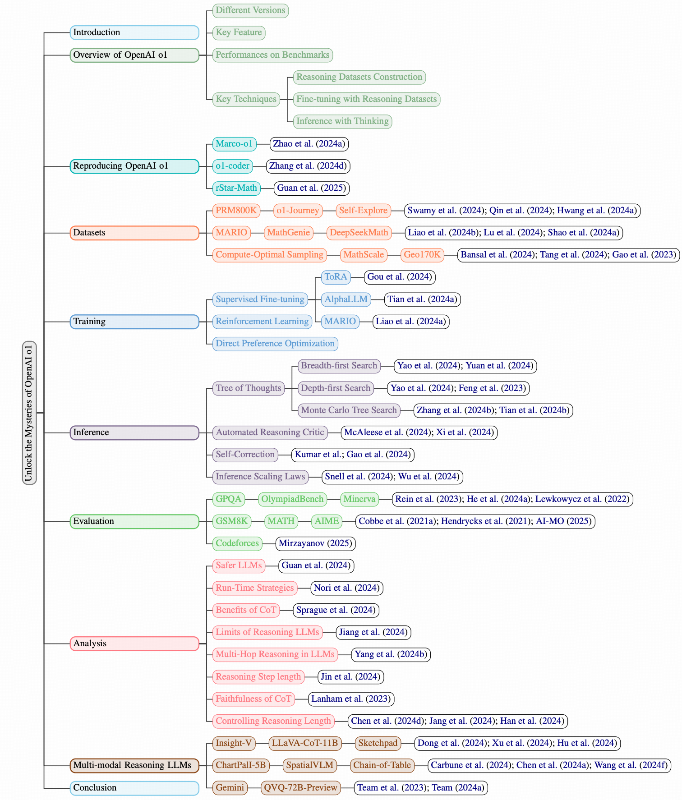

# A-Survey-of-the-Reasoning-Abilities-of-LLMs

This repository contains resources referenced in the paper [Unlocking the Mysteries of OpenAI o1: A Survey of the Reasoning Abilities of Large Language Models](https://openreview.net/pdf/893aca5e4e6ee8109c7e6c341856e5dfc2c7a12b.pdf). 

If you find this repository helpful, please cite the following:

## 🥳 News 

**Stay tuned! More related work will be updated!**
* **[26 Jan, 2025]** We update work related to two reasoning LLMs: Kimi-k1.5 and DeepSeek-R1.
* **[24 Jan, 2025]** The repository is created. 
* **[20 Jan, 2025]** We release the first version of the paper.

## Table of Contents
- [A-Survey-of-the-Reasoning-Abilities-of-LLMs](#a-survey-of-the-reasoning-abilities-of-llms)
  - [🥳 News](#-news)
  - [Table of Contents](#table-of-contents)
  - [Overview](#overview)
  - [Recent Efforts in Reproducing OpenAI o1](#recent-efforts-in-reproducing-openai-o1)
    - [Related Papers](#related-papers)
  - [Datasets](#datasets)
    - [Related Papers](#related-papers-1)
  - [Training](#training)
    - [Related Papers](#related-papers-2)
  - [Inference](#inference)
    - [Related Papers](#related-papers-3)
  - [Evaluation](#evaluation)
    - [Related Papers](#related-papers-4)
  - [Analysis of Reasoning LLMs](#analysis-of-reasoning-llms)
    - [Related Papers](#related-papers-5)
  - [Multi-modal Reasoning LLMs](#multi-modal-reasoning-llms)
    - [Related Papers](#related-papers-6)

## Overview

The release of OpenAI's o1 marks a significant milestone in AI, achieving proficiency comparable to PhD-level expertise in mathematics and coding. While o1 excels at solving complex reasoning tasks, it remains a closed-resource model, limiting its accessibility and broader application in academic and industrial contexts. Despite numerous efforts to replicate o1's results, these attempts often focus on isolated aspects of the model (e.g., training, inference), neglecting the holistic interplay between components and failing to provide a global picture of the pathways to enhance LLMs' reasoning capabilities, and  replicate o1's performance.
Currently, there is no systematic review of these replication efforts, nor a clear survey of the major issues that must be addressed to achieve comparable performance to o1.

In this [survey](https://openreview.net/pdf/893aca5e4e6ee8109c7e6c341856e5dfc2c7a12b.pdf), we are going to provide a systematic review of the most up-to-date state of knowledge on reasoning LLMs, helping researchers understand the current challenges and advancements in this field. 
We will summarize recent efforts to replicate o1's performances, and more importantly, address the key obstacles in enhancing the reasoning abilities.
We will (1) review the basic concepts and techniques behind o1 and efforts in replicating o1 models; (2) detail efforts in constructing logical and structured reasoning datasets; (3) delve into important training techniques (e.g., supervised fine-tuning, reinforcement learning, DPO) that harness these datasets to ensure the model acquires robust logical reasoning and structured problem-solving capabilities; and (4) explores 
different
inference techniques (e.g., tree-of-thoughts, critic-based approaches, self-correction strategies) in reasoning LLMs that assist in navigating the problem space and identifying efficient problem-solving paths. We will also summarize the current challenges and discuss opportunities for further improvement of reasoning LLMs.

The typology of the paper is as follows: 

  

## Recent Efforts in Reproducing OpenAI o1

<table border="1" style="text-align:center;">
<tr>
        <th>Model</th>
        <th>Organization</th> 
        <th># Params</th> 
        <th>Project</th>
        <th>Paper</th>
        <th>Comparison with o1</th>
</tr>

<tr>
        <td>Gemini 2.0 Flash [<a href="#ref1">1</a>]</td>
        <td>Google</td> 
        <td>-</td> 
        <td>-</td>
        <td>-</td>
        <td>No</td>
</tr>

<tr>
        <td>DeepSeek-R1-Lite-Preview [<a href="#ref2">2</a>]</td>
        <td>DeepSeek</td> 
        <td>-</td> 
        <td>-</td>
        <td>-</td>
        <td>Yes</td>
</tr>

<tr>
        <td>QVQ-72B-Preview [<a href="#ref3">3</a>]</td>
        <td>Alibaba</td> 
        <td>72B</td> 
        <td><a href="https://huggingface.co/Qwen/QVQ-72B-Preview" target="_blank">project</a></td>
        <td>-</td>
        <td>Yes</td>
</tr>

<tr>
        <td>Marco-o1 [<a href="#ref4">4</a>]</td>
        <td>Alibaba</td> 
        <td>7B</td> 
        <td><a href="https://github.com/AIDC-AI/Marco-o1" target="_blank">project</a></td>
         <td><a href="https://arxiv.org/pdf/2501.04519" target="_blank">report</a></td>
        <td>No</td>
</tr>

<tr>
        <td>Skywork o1 [<a href="#ref5">5</a>]</td>
        <td>KUNLUN</td> 
        <td>8B</td> 
        <td><a href="https://huggingface.co/Skywork/Skywork-o1-Open-Llama-3.1-8B" target="_blank">project</a></td>
        <td>-</td>
        <td>No</td>
</tr>

<tr>
        <td>QwQ-32B-Preview [<a href="#ref6">6</a>]</td>
        <td>Alibaba</td> 
        <td>32B</td> 
        <td><a href="https://huggingface.co/Qwen/QwQ-32B-Preview" target="_blank">project</a></td>
        <td>-</td>
        <td>Yes</td>
</tr>

<tr>
        <td>o1-Coder [<a href="#ref7">7</a>]</td>
        <td>Beijing Jiaotong University</td> 
        <td>-</td> 
        <td><a href="https://github.com/ADaM-BJTU/o1-Coder" target="_blank">project</a></td>
        <td><a href="https://arxiv.org/pdf/2411.14405" target="_blank">paper</a></td>
        <td>No</td>
</tr>

<tr>
        <td>rStar-Math [<a href="#ref7">7</a>]</td>
        <td>Microsoft</td> 
        <td>1.5B,3B,7B</td> 
        <td><a href="https://github.com/zhentingqi/rStar" target="_blank">project</a></td>
        <td><a href="https://arxiv.org/pdf/2412.00154" target="_blank">paper</a></td>
        <td>Yes</td>
</tr>

<tr>
        <td>Kimi-k1.5 [<a href="#ref8">8</a>]</td>
        <td>Moonshot AI</td> 
        <td>-</td> 
        <td>No</td>
        <td><a href="https://arxiv.org/pdf/2501.12599" target="_blank">paper</a></td>
        <td>Yes</td>
</tr>

<tr>
        <td>DeepSeek-R1 [<a href="#ref9">9</a>]</td>
        <td>DeepSeek</td> 
        <td>671B-A31B</td> 
        <td><a href="https://huggingface.co/deepseek-ai/DeepSeek-R1" target="_blank">project</a></td>
        <td><a href="https://arxiv.org/pdf/2501.12948" target="_blank">paper</a></td>
        <td>Yes</td>
</tr>

</table>

### Related Papers
<a id="ref1">[1]</a> Google AI. **Thinking Mode - Gemini API Documentation**. [Paper](https://ai.google.dev/gemini-api/docs/thinking-mode)

<a id="ref2">[2]</a> DeepSeek. **News1120 - DeepSeek API Documentation**. [Paper](https://api-docs.deepseek.com/news/news1120)

<a id="ref3">[3]</a> QwenLM, QVQ. **QVQ-72B Preview - QwenLM Blog**. [Paper](https://qwenlm.github.io/blog/qvq-72b-preview)

<a id="ref4">[4]</a> Zhao, Yu and Yin, Huifeng and Zeng, Bo and Wang, Hao and Shi, Tianqi and Lyu, Chenyang and Wang, Longyue and Luo, Weihua and Zhang, Kaifu. **Marco-o1: Towards open reasoning models for open-ended solutions**. arXiv preprint arXiv:2411.14405. [Paper](https://arxiv.org/abs/2411.14405)

<a id="ref5">[5]</a> Skywork-o1 Team. **Skywork-o1 Open Series**. [Paper](https://huggingface.co/Skywork)

<a id="ref6">[6]</a> QwenLM, QwQ. **QWQ-32B Preview - QwenLM Blog**. [Paper](https://qwenlm.github.io/blog/qwq-32b-preview)

<a id="ref7">[7]</a> Zhang, Yuxiang and Wu, Shangxi and Yang, Yuqi and Shu, Jiangming and Xiao, Jinlin and Kong, Chao and Sang, Jitao. **o1-coder: an o1 replication for coding**. arXiv preprint arXiv:2412.00154. [Paper](https://arxiv.org/abs/2412.00154)

<a id="ref7">[7]</a> Guan, Xinyu and Zhang, Li Lyna and Liu, Yifei and Shang, Ning and Sun, Youran and Zhu, Yi and Yang, Fan and Yang, Mao. **rStar-Math: Small LLMs Can Master Math Reasoning with Self-Evolved Deep Thinking**. arXiv preprint arXiv:2412.00154. [Paper](https://arxiv.org/abs/2501.04519)

<a id="ref8">[8]</a> Kimi Team and Angang Du and Bofei Gao and Bowei Xing and Changjiu Jiang and Cheng Chen and Cheng Li and Chenjun Xiao and Chenzhuang Du and Chonghua Liao and Chuning Tang and Congcong Wang and Dehao Zhang and Enming Yuan and Enzhe Lu and Fengxiang Tang and Flood Sung and Guangda Wei and Guokun Lai and Haiqing Guo and Han Zhu and Hao Ding and Hao Hu and Hao Yang and Hao Zhang and Haotian Yao and Haotian Zhao and Haoyu Lu and Haoze Li and Haozhen Yu and Hongcheng Gao and Huabin Zheng and Huan Yuan and Jia Chen and Jianhang Guo and Jianlin Su and Jianzhou Wang and Jie Zhao and Jin Zhang and Jingyuan Liu and Junjie Yan and Junyan Wu and Lidong Shi and Ling Ye and Longhui Yu and Mengnan Dong and Neo Zhang and Ningchen Ma and Qiwei Pan and Qucheng Gong and Shaowei Liu and Shengling Ma and Shupeng Wei and Sihan Cao and Siying Huang and Tao Jiang and Weihao Gao and Weimin Xiong and Weiran He and Weixiao Huang and Wenhao Wu and Wenyang He and Xianghui Wei and Xianqing Jia and Xingzhe Wu and Xinran Xu and Xinxing Zu and Xinyu Zhou and Xuehai Pan and Y. Charles and Yang Li and Yangyang Hu and Yangyang Liu and Yanru Chen and Yejie Wang and Yibo Liu and Yidao Qin and Yifeng Liu and Ying Yang and Yiping Bao and Yulun Du and Yuxin Wu and Yuzhi Wang and Zaida Zhou and Zhaoji Wang and Zhaowei Li and Zhen Zhu and Zheng Zhang and Zhexu Wang and Zhilin Yang and Zhiqi Huang and Zihao Huang and Ziyao Xu and Zonghan Yang. **Kimi k1.5: Scaling Reinforcement Learning with LLMs**. arXiv preprint arXiv:2501.12599. [Paper](https://arxiv.org/abs/2501.12599)

<a id="ref9">[9]</a> DeepSeek-AI and Daya Guo and Dejian Yang and Haowei Zhang and Junxiao Song and Ruoyu Zhang and Runxin Xu and Qihao Zhu and Shirong Ma and Peiyi Wang and Xiao Bi and Xiaokang Zhang and Xingkai Yu and Yu Wu and Z. F. Wu and Zhibin Gou and Zhihong Shao and Zhuoshu Li and Ziyi Gao and Aixin Liu and Bing Xue and Bingxuan Wang and Bochao Wu and Bei Feng and Chengda Lu and Chenggang Zhao and Chengqi Deng and Chenyu Zhang and Chong Ruan and Damai Dai and Deli Chen and Dongjie Ji and Erhang Li and Fangyun Lin and Fucong Dai and Fuli Luo and Guangbo Hao and Guanting Chen and Guowei Li and H. Zhang and Han Bao and Hanwei Xu and Haocheng Wang and Honghui Ding and Huajian Xin and Huazuo Gao and Hui Qu and Hui Li and Jianzhong Guo and Jiashi Li and Jiawei Wang and Jingchang Chen and Jingyang Yuan and Junjie Qiu and Junlong Li and J. L. Cai and Jiaqi Ni and Jian Liang and Jin Chen and Kai Dong and Kai Hu and Kaige Gao and Kang Guan and Kexin Huang and Kuai Yu and Lean Wang and Lecong Zhang and Liang Zhao and Litong Wang and Liyue Zhang and Lei Xu and Leyi Xia and Mingchuan Zhang and Minghua Zhang and Minghui Tang and Meng Li and Miaojun Wang and Mingming Li and Ning Tian and Panpan Huang and Peng Zhang and Qiancheng Wang and Qinyu Chen and Qiushi Du and Ruiqi Ge and Ruisong Zhang and Ruizhe Pan and Runji Wang and R. J. Chen and R. L. Jin and Ruyi Chen and Shanghao Lu and Shangyan Zhou and Shanhuang Chen and Shengfeng Ye and Shiyu Wang and Shuiping Yu and Shunfeng Zhou and Shuting Pan and S. S. Li and Shuang Zhou and Shaoqing Wu and Shengfeng Ye and Tao Yun and Tian Pei and Tianyu Sun and T. Wang and Wangding Zeng and Wanjia Zhao and Wen Liu and Wenfeng Liang and Wenjun Gao and Wenqin Yu and Wentao Zhang and W. L. Xiao and Wei An and Xiaodong Liu and Xiaohan Wang and Xiaokang Chen and Xiaotao Nie and Xin Cheng and Xin Liu and Xin Xie and Xingchao Liu and Xinyu Yang and Xinyuan Li and Xuecheng Su and Xuheng Lin and X. Q. Li and Xiangyue Jin and Xiaojin Shen and Xiaosha Chen and Xiaowen Sun and Xiaoxiang Wang and Xinnan Song and Xinyi Zhou and Xianzu Wang and Xinxia Shan and Y. K. Li and Y. Q. Wang and Y. X. Wei and Yang Zhang and Yanhong Xu and Yao Li and Yao Zhao and Yaofeng Sun and Yaohui Wang and Yi Yu and Yichao Zhang and Yifan Shi and Yiliang Xiong and Ying He and Yishi Piao and Yisong Wang and Yixuan Tan and Yiyang Ma and Yiyuan Liu and Yongqiang Guo and Yuan Ou and Yuduan Wang and Yue Gong and Yuheng Zou and Yujia He and Yunfan Xiong and Yuxiang Luo and Yuxiang You and Yuxuan Liu and Yuyang Zhou and Y. X. Zhu and Yanhong Xu and Yanping Huang and Yaohui Li and Yi Zheng and Yuchen Zhu and Yunxian Ma and Ying Tang and Yukun Zha and Yuting Yan and Z. Z. Ren and Zehui Ren and Zhangli Sha and Zhe Fu and Zhean Xu and Zhenda Xie and Zhengyan Zhang and Zhewen Hao and Zhicheng Ma and Zhigang Yan and Zhiyu Wu and Zihui Gu and Zijia Zhu and Zijun Liu and Zilin Li and Ziwei Xie and Ziyang Song and Zizheng Pan and Zhen Huang and Zhipeng Xu and Zhongyu Zhang and Zhen Zhang. **DeepSeek-R1: Incentivizing Reasoning Capability in LLMs via Reinforcement Learning**. arXiv preprint arXiv:2501.12948. [Paper](https://arxiv.org/abs/2501.12948)

## Datasets

In this section, we provide a detailed overview of the construction processes for reasoning datasets that can be used in developing reasoning LLMs like OpenAI o1. These datasets are typically constructed using one or a combination of the following two strategies: the **machine-generated**, where a trained model provides feedback, responses or grades, and the  **human-generated**, where humans are asked to provide feedback.

<table border="1" style="text-align:center;">
<tr>
        <th>Dataset</th>
        <th>Data Source</th> 
        <th>Data Scale</th> 
        <th>Machine Generated</th>
        <th>Human Generated</th>
        <th>Open Source</th>
</tr>

<tr>
        <td>PRM800K [<a href="#ref1">1</a>]</td>
        <td>MATH </td> 
        <td>800K annotations</td> 
        <td>Yes</td>
        <td>Yes</td>
        <td><a href="https://github.com/openai/prm800k" target="_blank">project</a></td>
</tr>

<tr>
        <td>O1-Journey [<a href="#ref2">2</a>]</td>
        <td>MATH, PRM800K</td> 
        <td>677 instances</td> 
        <td>Yes</td>
        <td>Yes</td>
        <td><a href="https://github.com/GAIR-NLP/O1-Journey" target="_blank">project</a></td>
</tr>

<tr>
        <td>Self-Explore [<a href="#ref3">3</a>]</td>
        <td>GSM8K, MATH</td> 
        <td>Model-specific</td> 
        <td>Yes</td>
        <td>No</td>
        <td>No</td>
</tr>

<tr>
        <td>MARIO [<a href="#ref4">4</a>]</td>
        <td>GSM8K, MATH, MetaMath</td> 
        <td>28.8K instances </td> 
        <td>Yes</td>
        <td>Yes</td>
        <td><a href="https://github.com/MARIO-Math-Reasoning/MARIO" target="_blank">project</a></td>
</tr>

<tr>
        <td>MathGenie [<a href="#ref5">5</a>]</td>
        <td>GSM8K, MATH </td> 
        <td>170K qa pairs</td> 
        <td>Yes</td>
        <td>No</td>
        <td>No</td>
</tr>

<tr>
        <td>DeepSeekMath [<a href="#ref6">6</a>]</td>
        <td>AlgebraicStack, arXiv, GitHub</td> 
        <td>120B tokens</td> 
        <td>Yes</td>
        <td>Yes</td>
        <td><a href="https://github.com/deepseek-ai/DeepSeek-Math" target="_blank">project</a></td>
</tr>

<tr>
        <td>Compute-Optimal Sampling [<a href="#ref7">7</a>]</td>
        <td>GSM8K, MATH, etc.</td> 
        <td>Model-specific</td> 
        <td>Yes</td>
        <td>No</td>
        <td>No</td>
</tr>

<tr>
        <td>MathScale [<a href="#ref8">8</a>]</td>
        <td>GSM8K, MATH</td> 
        <td>2M qa pairs </td> 
        <td>Yes</td>
        <td>No</td>
        <td><a href="https://github.com/XylonFu/MathScale" target="_blank">project</a></td>
</tr>

<tr>
        <td>G-LLaVA  [<a href="#ref9">9</a>]</td>
        <td>Geometry3K, GeoQA+</td> 
        <td>170K instances </td> 
        <td>Yes</td>
        <td>No</td>
        <td><a href="https://github.com/pipilurj/G-LLaVA" target="_blank">project</a></td>
</tr>

</table>

### Related Papers
<a id="ref1">[1]</a> Swamy, Gokul and Dann, Christoph and Kidambi, Rahul and Wu, Zhiwei Steven and Agarwal, Alekh. **A minimaximalist approach to reinforcement learning from human feedback**. arXiv preprint arXiv:2401.04056. [Paper](https://arxiv.org/abs/2401.04056)

<a id="ref2">[2]</a> Yiwei Qin and Xuefeng Li and Haoyang Zou and Yixiu Liu and Shijie Xia and Zhen Huang and Yixin Ye and Weizhe Yuan and Hector Liu and Yuanzhi Li and Pengfei Liu. **O1 Replication Journey: A Strategic Progress Report -- Part 1**. arXiv preprint arXiv:2410.18982. [Paper](https://arxiv.org/abs/2410.18982)

<a id="ref3">[3]</a> Hyeonbin Hwang and Doyoung Kim and Seungone Kim and Seonghyeon Ye and Minjoon Seo. **Self-Explore: Enhancing Mathematical Reasoning in Language Models with Fine-grained Rewards**. arXiv preprint arXiv:2404.10346. [Paper](https://arxiv.org/abs/2404.10346)

<a id="ref4">[4]</a> Minpeng Liao and Wei Luo and Chengxi Li and Jing Wu and Kai Fan. **MARIO: MAth Reasoning with code Interpreter Output -- A Reproducible Pipeline**. arXiv preprint arXiv:2401.08190. [Paper](https://arxiv.org/abs/2401.08190)

<a id="ref5">[5]</a> Zimu Lu and Aojun Zhou and Houxing Ren and Ke Wang and Weikang Shi and Junting Pan and Mingjie Zhan and Hongsheng Li. **MathGenie: Generating Synthetic Data with Question Back-translation for Enhancing Mathematical Reasoning of LLMs**. arXiv preprint arXiv:2402.16352. [Paper](https://arxiv.org/abs/2402.16352)

<a id="ref6">[6]</a> Zhihong Shao and Peiyi Wang and Qihao Zhu and Runxin Xu and Junxiao Song and Xiao Bi and Haowei Zhang and Mingchuan Zhang and Y. K. Li and Y. Wu and Daya Guo. **DeepSeekMath: Pushing the Limits of Mathematical Reasoning in Open Language Models**. arXiv preprint arXiv:2402.03300. [Paper](https://arxiv.org/abs/2402.03300)

<a id="ref7">[7]</a> Hritik Bansal and Arian Hosseini and Rishabh Agarwal and Vinh Q. Tran and Mehran Kazemi. **Smaller, Weaker, Yet Better: Training LLM Reasoners via Compute-Optimal Sampling**. arXiv preprint arXiv:2408.16737. [Paper](https://arxiv.org/abs/2408.16737)

<a id="ref8">[8]</a> Zhengyang Tang and Xingxing Zhang and Benyou Wang and Furu Wei. **MathScale: Scaling Instruction Tuning for Mathematical Reasoning**. arXiv preprint arXiv:2403.02884. [Paper](https://arxiv.org/abs/2403.02884)

<a id="ref9">[9]</a> Jiahui Gao and Renjie Pi and Jipeng Zhang and Jiacheng Ye and Wanjun Zhong and Yufei Wang and Lanqing Hong and Jianhua Han and Hang Xu and Zhenguo Li and Lingpeng Kong. **G-LLaVA: Solving Geometric Problem with Multi-Modal Large Language Model**. arXiv preprint arXiv:2312.11370. [Paper](https://arxiv.org/abs/2312.11370)

## Training

Reasoning datasets are meticulously structured, often representing step-by-step problem-solving processes. Effectively training LLMs on such datasets requires methodologies that maximize the utility of each reasoning step, whether correct or erroneous. This section explores three key training paradigms designed to leverage reasoning datasets for training o1-like reasoning LLMs:

* **Supervised Fine-tuning (SFT)** : A foundational technique that refines pre-trained LLMs by explicitly teaching structured reasoning patterns through labeled (INSTRUCTION, ANSWER) pairs.
* **Reinforcement Learning from Human Feedback (RLHF)**: A refinement approach that aligns LLM outputs with human preferences or quality signals, further enhancing reasoning skills through iterative optimization.
* **Direct Preference Optimization (DPO)**: A simplified alternative to RLHF that directly optimizes fine-tuned LLMs for preferred reasoning outputs without requiring intermediate reward modeling.

<table border="1" style="text-align:center;">
<tr>
        <th>Paper</th>
        <th>Key Innovation </th> 
        <th>Main Techniques</th> 
</tr>

<tr>
        <td align="center" colspan="3"> Supervised Fine-tuning (SFT) </td> 
</tr>

<tr>
        <td>ToRA [<a href="#ref1">1</a>]</td>
        <td>Tool-integrated Mathematical Focused Reasoning Agents</td> 
        <td>Imitation Learning, Output Space Shaping</td> 
</tr>

<tr>
        <td>AlphaLLM [<a href="#ref2">2</a>]</td>
        <td>Self Improving Training</td> 
        <td>SFT with Monte Carlo Tree Search</td> 
</tr>

<tr>
        <td>MARIO [<a href="#ref3">3</a>]</td>
        <td>Mathematical Reasoning Framework</td> 
        <td>Data Enhancement with GPT-4, Human Review, and Self-training</td> 
</tr>

<tr>
        <td align="center" colspan="3"> Reinforcement Learning from Human Feedback (RLHF) </td> 
</tr>

<tr>
        <td>Self-Critiquing [<a href="#ref4">4</a>]</td>
        <td>Fundations of Language Model Self-Critiquing</td> 
        <td>AI-assisted Human Feedback</td> 
</tr>

<tr>
        <td>OVM [<a href="#ref5">5</a>]</td>
        <td>Evaluating the Potential of Incomplete Reasoning Paths</td> 
        <td>Outcome-supervised Value Models</td> 
</tr>

<tr>
        <td>PPO-MCTS [<a href="#ref6">6</a>]</td>
        <td>Value-Guided Decoding trhough PPO</td> 
        <td>Proximal Policy Optimization, Monte Carlo Tree Search</td> 
</tr>

<tr>
        <td>MATH-SHEPHERD [<a href="#ref7">7</a>]</td>
        <td>Eliminatioin of Human Annotation</td> 
        <td>step-wise verification through MCTS</td> 
</tr>

<tr>
        <td>Qwen-2.5-math [<a href="#ref8">8</a>]</td>
        <td>Enhanced Process Reward Model</td> 
        <td>LLM-as-a-judge</td> 
</tr>

<tr>
        <td>Roadmap to o1 [<a href="#ref9">9</a>]</td>
        <td>Combination of Various Techniques to Reproduce o1</td> 
        <td>Policy Initialization, Reward Shaping, Policy Gradient</td> 
</tr>

<tr>
        <td>PROCESSBENCH [<a href="#ref10">10</a>]</td>
        <td>Benchmark for Error Identification in Mathematical Reasoning</td> 
        <td>Step-level Error Detection</td> 
</tr>

<tr>
        <td>PRMBENCH [<a href="#ref11">11</a>]</td>
        <td>Fine-grained Benchmark for Process Reward Models</td> 
        <td>Multi-dimensional Evaluation Benchmark</td> 
</tr>

<tr>
        <td align="center" colspan="3"> Direct Preference Optimization (DPO) </td> 
</tr>

<tr>
        <td>CPO [<a href="#ref12">12</a>]</td>
        <td>Fine-tuning CoT reasoning with ToT</td> 
        <td>Tree-of-Thoughts framework, Paired preference fine-tuning</td> 
</tr>

<tr>
        <td>SVPO [<a href="#ref13">13</a>]</td>
        <td>Step-level preferences for reasoning improvement</td> 
        <td>MCTS for step-level preferences, Value model integration</td> 
</tr>

<tr>
        <td>PPO-MCTS [<a href="#ref14">14</a>]</td>
        <td>Value-guided decoding during inference</td> 
        <td>PPO value network MCTS</td> 
</tr>

<tr>
        <td>Self-Explore [<a href="#ref15">15</a>]</td>
        <td>Self-guided Learning with Fine-grained Rewards</td> 
        <td>First-pit Identifications</td> 
</tr>

<tr>
        <td>Agent Q [<a href="#ref16">16</a>]</td>
        <td>Enhanced Agentic reasoning</td> 
        <td>MCTS with AI feedback, Offline DPO</td> 
</tr>

</table>

### Related Papers
<a id="ref1">[1]</a> Zhibin Gou and Zhihong Shao and Yeyun Gong and Yelong Shen and Yujiu Yang and Minlie Huang and Nan Duan and Weizhu Chen. **ToRA: A Tool-Integrated Reasoning Agent for Mathematical Problem Solving**. arXiv preprint arXiv:2309.17452. [Paper](https://arxiv.org/abs/2309.17452)

<a id="ref2">[2]</a> Tian, Ye and Peng, Baolin and Song, Linfeng and Jin, Lifeng and Yu, Dian and Mi, Haitao and Yu, Dong. **Toward Self-Improvement of LLMs via Imagination, Searching, and Criticizing**. arXiv preprint arXiv:2404.12253. [Paper](https://arxiv.org/abs/2404.12253)

<a id="ref3">[3]</a> Liao, Minpeng  and Li, Chengxi  and Luo, Wei  and Jing, Wu  and Fan, Kai. **{MARIO}: {MA}th Reasoning with code Interpreter Output - A Reproducible Pipeline**. Association for Computational Linguistics. [Paper](https://aclanthology.org/2024.findings-acl.53/)

<a id="ref4">[4]</a> William Saunders and Catherine Yeh and Jeff Wu and Steven Bills and Long Ouyang and Jonathan Ward and Jan Leike. **Self-critiquing models for assisting human evaluators**. arXiv preprint arXiv:2206.05802. [Paper](https://arxiv.org/abs/2206.05802)

<a id="ref5">[5]</a> Yu, Fei and Gao, Anningzhe and Wang, Benyou. **Outcome-supervised verifiers for planning in mathematical reasoning**. arXiv preprint arXiv:2311.09724. [Paper](https://arxiv.org/abs/2311.09724)

<a id="ref6">[6]</a> Jiacheng Liu and Andrew Cohen and Ramakanth Pasunuru and Yejin Choi and Hannaneh Hajishirzi and Asli Celikyilmaz. **Don't throw away your value model! Generating more preferable text with Value-Guided Monte-Carlo Tree Search decoding**. arXiv preprint arXiv:2309.15028. [Paper](https://arxiv.org/abs/2309.15028)

<a id="ref7">[7]</a> Wang, Peiyi and Li, Lei and Shao, Zhihong  and Xu, Runxin  and Dai, Damai  and Li, Yifei and Chen, Deli and Wu, Yu and Sui, Zhifang. **Math-Shepherd: Verify and Reinforce {LLM}s Step-by-step without Human Annotations**. Association for Computational Linguistics. [Paper](https://aclanthology.org/2024.acl-long.510/)

<a id="ref8">[8]</a> Zhenru Zhang and Chujie Zheng and Yangzhen Wu and Beichen Zhang and Runji Lin and Bowen Yu and Dayiheng Liu and Jingren Zhou and Junyang Lin. **The Lessons of Developing Process Reward Models in Mathematical Reasoning**. arXiv preprint arXiv:2501.07301. [Paper](https://arxiv.org/abs/2501.07301)

<a id="ref9">[9]</a> Zhiyuan Zeng and Qinyuan Cheng and Zhangyue Yin and Bo Wang and Shimin Li and Yunhua Zhou and Qipeng Guo and Xuanjing Huang and Xipeng Qiu. **Scaling of Search and Learning: A Roadmap to Reproduce o1 from Reinforcement Learning Perspective**. arXiv preprint arXiv:2412.14135. [Paper](https://arxiv.org/abs/2412.14135)

<a id="ref10">[10]</a> Chujie Zheng and Zhenru Zhang and Beichen Zhang and Runji Lin and Keming Lu and Bowen Yu and Dayiheng Liu and Jingren Zhou and Junyang Lin. **ProcessBench: Identifying Process Errors in Mathematical Reasoning**. arXiv preprint arXiv:2412.06559. [Paper](https://arxiv.org/abs/2412.06559)

<a id="ref11">[11]</a> Mingyang Song and Zhaochen Su and Xiaoye Qu and Jiawei Zhou and Yu Cheng. **PRMBench: A Fine-grained and Challenging Benchmark for Process-Level Reward Models**. arXiv preprint arXiv:2501.03124. [Paper](https://arxiv.org/abs/2501.03124)

<a id="ref12">[12]</a> Xuan Zhang and Chao Du and Tianyu Pang and Qian Liu and Wei Gao and Min Lin. **Chain of Preference Optimization: Improving Chain-of-Thought Reasoning in LLMs**. arXiv preprint arXiv:2406.09136. [Paper](https://arxiv.org/abs/2406.09136)

<a id="ref13">[13]</a> Guoxin Chen and Minpeng Liao and Chengxi Li and Kai Fan. **Step-level Value Preference Optimization for Mathematical Reasoning**. arXiv preprint arXiv:2406.10858. [Paper](https://arxiv.org/abs/2406.10858)

<a id="ref14">[14]</a> Jiacheng Liu and Andrew Cohen and Ramakanth Pasunuru and Yejin Choi and Hannaneh Hajishirzi and Asli Celikyilmaz. **Don't throw away your value model! Generating more preferable text with Value-Guided Monte-Carlo Tree Search decoding**. arXiv preprint arXiv:2309.15028. [Paper](https://arxiv.org/abs/2309.15028)

<a id="ref15">[15]</a> Hyeonbin Hwang and Doyoung Kim and Seungone Kim and Seonghyeon Ye and Minjoon Seo. **Self-Explore: Enhancing Mathematical Reasoning in Language Models with Fine-grained Rewards**. arXiv preprint arXiv:2404.10346. [Paper](https://arxiv.org/abs/2404.10346)

<a id="ref16">[16]</a> Pranav Putta and Edmund Mills and Naman Garg and Sumeet Motwani and Chelsea Finn and Divyansh Garg and Rafael Rafailov. **Agent Q: Advanced Reasoning and Learning for Autonomous AI Agents**. arXiv preprint arXiv:2408.07199. [Paper](https://arxiv.org/abs/2408.07199)

## Inference

Multi-step reasoning tasks are prone to errors at any step, as small mistakes can cascade into incorrect final answers. To address this, reasoning LLMs often generate multiple reasoning paths for a given input question during the inference stage and choose the answer that aligns best with the most logically consistent and broadly supported reasoning steps.

In this section covers the following three widely used techniques in reasoning LLMs, which we think are crucial in building o1-like reasoning models: 

* **Tree of Thoughts**, which represents the reasoning process as a tree structure and explores various branches to determine the most effective path.
* **Automated Reasoning Critic**, which employs a trained critic model to evaluate and validate the reasoning steps generated by the LLMs.
* **Self-Correction**, where the LLM mimics human critical thinking by iteratively reviewing, identifying errors, and refining its reasoning steps to enhance accuracy and logical consistency.

In addition to these three inference techniques, we will also explore "Inference Scaling Laws", which provide insights into how reasoning performance improves as inference time increases, enabling us to balance the trade-off between computational efficiency and reasoning accuracy.

<table border="1" style="text-align:center;">
<tr>
        <th>Paper</th>
        <th>Key Innovation </th> 
        <th>Main Techniques</th> 
</tr>

<tr>
        <td align="center" colspan="3"> Tree of Thoughts </td> 
</tr>

<tr>
        <td>Tree of Thoughts [<a href="#ref1">1</a>]</td>
        <td>1st tree-structured reasoning framework</td> 
        <td>BFS/DFS search, Self-evaluation, Backtracking</td> 
</tr>

<tr>
        <td>EURUS [<a href="#ref2">2</a>]</td>
        <td>Tree-structured alignment dataset </td> 
        <td>ULTRAINTERACT dataset, Preference learning</td> 
</tr>

<tr>
        <td>TS-LLM [<a href="#ref3">3</a>]</td>
        <td>AlphaZero-inspired framework</td> 
        <td>Markov Decision Process (MDP) formulation, Deep search (64 depth)</td> 
</tr>

<tr>
        <td>MCTSr [<a href="#ref4">4</a>]</td>
        <td>Enhanced MCTS for math</td> 
        <td>Self-reflection, Dynamic pruning, Upper Confidence Bound (UCB)</td> 
</tr>

<tr>
        <td>ALPHALLM [<a href="#ref5">5</a>]</td>
        <td>Self-improvement framework </td> 
        <td>Option-level MCTS, Adaptive branching, State merging</td> 
</tr>

<tr>
        <td>MCTS-DPO [<a href="#ref6">6</a>]</td>
        <td>Step-level preference learning w/ MCTS</td> 
        <td>MCTS guided exploration, DPO updates, Step-level signals</td> 
</tr>

<tr>
        <td>AlphaMath [<a href="#ref7">7</a>]</td>
        <td>Self-supervised MCTS reasoning</td> 
        <td>Step-level value model, Beam search, Self-improvement</td> 
</tr>

<tr>
        <td>ReST-MCTS [<a href="#ref8">8</a>]</td>
        <td>Process-reward enhanced MCTS</td> 
        <td>Per-step rewards, Dual optimization, Dynamic exploration</td> 
</tr>

<tr>
        <td align="center" colspan="3"> Automated Reasoning Critic </td> 
</tr>

<tr>
        <td>CriticGPT [<a href="#ref9">9</a>]</td>
        <td>LLM-based code critique</td> 
        <td>Tampered data generation, RLHF, Bugs identifying</td> 
</tr>

<tr>
        <td>AutoMathCritique [<a href="#ref10">10</a>]</td>
        <td>Two-player math reasoning</td> 
        <td>Dynamic supervision, Error generation</td> 
</tr>

<tr>
        <td>LLM-ARC [<a href="#ref11">11</a>]</td>
        <td>Neuro-symbolic reasoning</td> 
        <td>LLM + reasoning engine integration, Answer Set Programming (ASP) solver</td> 
</tr>

<tr>
        <td align="center" colspan="3"> Self-Correction </td> 
</tr>

<tr>
        <td>SCoRe [<a href="#ref12">12</a>]</td>
        <td>Multi-turn RL framework </td> 
        <td>Self-generated data, Two-stage training, Reward shaping</td> 
</tr>

<tr>
        <td>CoSC [<a href="#ref13">13</a>]</td>
        <td>Embedded self-correction</td> 
        <td>Program generation, execution, and verification, Two-phase fine-tuning</td> 
</tr>

<tr>
        <td>DotaMath [<a href="#ref14">14</a>]</td>
        <td>Integrated mathematical reasoning</td> 
        <td>Multi-round correction, Python executor, Task decomposition</td> 
</tr>

<tr>
        <td align="center" colspan="3"> Inference Scaling Laws </td> 
</tr>

<tr>
        <td>Scale-Compute [<a href="#ref15">15</a>]</td>
        <td>Test-time compute analysis</td> 
        <td>Compute-optimal strategy, Process-based Reward Models (PRMs) search</td> 
</tr>

<tr>
        <td>REBASE [<a href="#ref16">16</a>]</td>
        <td>Reward balanced search </td> 
        <td>Dynamic tree optimization, Pruning with a reward model</td> 
</tr>

<tr>
        <td>LLMonkeys [<a href="#ref17">17</a>]</td>
        <td>Sampling analysis </td> 
        <td>Repeated sampling, Exponentiated power law, Cost optimization</td> 
</tr>

<tr>
        <td>STILL-2 [<a href="#ref18">18</a>]</td>
        <td>Three-phase training  </td> 
        <td>Lmitation, Exploration, Self-improvement, Long-form Thought Dataset</td> 
</tr>

<tr>
        <td>MindStar [<a href="#ref19">19</a>]</td>
        <td>No-tuning enhancement   </td> 
        <td>PRM-guided search, Dynamic exploration, Levin tree search</td> 
</tr>

</table>

### Related Papers
<a id="ref1">[1]</a> Yao, Shunyu and Yu, Dian and Zhao, Jeffrey and Shafran, Izhak and Griffiths, Tom and Cao, Yuan and Narasimhan, Karthik. **Tree of thoughts: Deliberate problem solving with large language models**. Advances in Neural Information Processing Systems. [Paper](https://arxiv.org/abs/2305.10601)

<a id="ref2">[2]</a> Yuan, Weizhe and Pang, Richard Yuanzhe and Cho, Kyunghyun and Sukhbaatar, Sainbayar and Xu, Jing and Weston, Jason. **Self-rewarding language models**. arXiv preprint arXiv:2401.10020. [Paper](https://arxiv.org/abs/2401.10020)

<a id="ref3">[3]</a> Feng, Xidong and Wan, Ziyu and Wen, Muning and McAleer, Stephen Marcus and Wen, Ying and Zhang, Weinan and Wang, Jun. **Alphazero-like tree-search can guide large language model decoding and training**. arXiv preprint arXiv:2309.17179. [Paper](https://arxiv.org/abs/2309.17179)

<a id="ref4">[4]</a> Zhang, Di and Huang, Xiaoshui and Zhou, Dongzhan and Li, Yuqiang and Ouyang, Wanli. **Accessing gpt-4 level mathematical olympiad solutions via monte carlo tree self-refine with llama-3 8b**. arXiv preprint arXiv:2406.07394. [Paper](https://arxiv.org/abs/2406.07394)

<a id="ref5">[5]</a> Tian, Ye and Peng, Baolin and Song, Linfeng and Jin, Lifeng and Yu, Dian and Mi, Haitao and Yu, Dong. **Toward Self-Improvement of LLMs via Imagination, Searching, and Criticizing**. arXiv preprint arXiv:2404.12253. [Paper](https://arxiv.org/abs/2404.12253)

<a id="ref6">[6]</a> Xie, Yuxi and Goyal, Anirudh and Zheng, Wenyue and Kan, Min-Yen and Lillicrap, Timothy P and Kawaguchi, Kenji and Shieh, Michael. **Monte Carlo Tree Search Boosts Reasoning via Iterative Preference Learning**. arXiv preprint arXiv:2405.00451. [Paper](https://arxiv.org/abs/2405.00451)

<a id="ref7">[7]</a> Chen, Guoxin and Liao, Minpeng and Li, Chengxi and Fan, Kai. **AlphaMath Almost Zero: process Supervision without process**. arXiv preprint arXiv:2405.03553. [Paper](https://arxiv.org/abs/2405.03553)

<a id="ref8">[8]</a> Zhang, Dan and Zhoubian, Sining and Hu, Ziniu and Yue, Yisong and Dong, Yuxiao and Tang, Jie. **Rest-mcts: Llm self-training via process reward guided tree search**. arXiv preprint arXiv:2406.03816. [Paper](https://arxiv.org/abs/2406.03816)

<a id="ref9">[9]</a> McAleese, Nat and Pokorny, Rai Michael and Uribe, Juan Felipe Ceron and Nitishinskaya, Evgenia and Trebacz, Maja and Leike, Jan. **Llm critics help catch llm bugs**. arXiv preprint arXiv:2407.00215. [Paper](https://arxiv.org/abs/2407.00215)

<a id="ref10">[10]</a> Xi, Zhiheng and Yang, Dingwen and Huang, Jixuan and Tang, Jiafu and Li, Guanyu and Ding, Yiwen and He, Wei and Hong, Boyang and Do, Shihan and Zhan, Wenyu and others. **Enhancing LLM Reasoning via Critique Models with Test-Time and Training-Time Supervision**. arXiv preprint arXiv:2411.16579. [Paper](https://arxiv.org/abs/2411.16579)

<a id="ref11">[11]</a> Kalyanpur, Aditya and Saravanakumar, Kailash Karthik and Barres, Victor and Chu-Carroll, Jennifer and Melville, David and Ferrucci, David. **Llm-arc: Enhancing llms with an automated reasoning critic**. arXiv preprint arXiv:2406.17663. [Paper](https://arxiv.org/abs/2406.17663)

<a id="ref12">[12]</a> Kumar, Aviral and Zhuang, Vincent and Agarwal, Rishabh and Su, Yi and Co-Reyes, John D and Singh, Avi and Baumli, Kate and Iqbal, Shariq and Bishop, Colton and Roelofs, Rebecca and others. **Training language models to self-correct via reinforcement learning, 2024**. arXiv preprint arXiv:2409.12917. [Paper](https://arxiv.org/abs/2409.12917)

<a id="ref13">[13]</a> Gao, Kuofeng and Cai, Huanqia and Shuai, Qingyao and Gong, Dihong and Li, Zhifeng. **Embedding Self-Correction as an Inherent Ability in Large Language Models for Enhanced Mathematical Reasoning**. arXiv preprint arXiv:2410.10735. [Paper](https://arxiv.org/abs/2410.10735)

<a id="ref14">[14]</a> Li, Chengpeng and Dong, Guanting and Xue, Mingfeng and Peng, Ru and Wang, Xiang and Liu, Dayiheng. **Dotamath: Decomposition of thought with code assistance and self-correction for mathematical reasoning**. arXiv preprint arXiv:2407.04078. [Paper](https://arxiv.org/abs/2407.04078)

<a id="ref15">[15]</a> Snell, Charlie and Lee, Jaehoon and Xu, Kelvin and Kumar, Aviral. **Scaling llm test-time compute optimally can be more effective than scaling model parameters**. arXiv preprint arXiv:2408.03314. [Paper](https://arxiv.org/abs/2408.03314)

<a id="ref16">[16]</a> Wu, Yangzhen and Sun, Zhiqing and Li, Shanda and Welleck, Sean and Yang, Yiming. **Inference scaling laws: An empirical analysis of compute-optimal inference for problem-solving with language models**. arXiv preprint arXiv:2408.00724. [Paper](https://arxiv.org/abs/2408.00724)

<a id="ref17">[17]</a> Brown, Bradley and Juravsky, Jordan and Ehrlich, Ryan and Clark, Ronald and Le, Quoc V and R{\'e}, Christopher and Mirhoseini, Azalia. **Large language monkeys: Scaling inference compute with repeated sampling**. arXiv preprint arXiv:2407.21787. [Paper](https://arxiv.org/abs/2407.21787)

<a id="ref18">[18]</a> Min, Yingqian and Chen, Zhipeng and Jiang, Jinhao and Chen, Jie and Deng, Jia and Hu, Yiwen and Tang, Yiru and Wang, Jiapeng and Cheng, Xiaoxue and Song, Huatong and others. **Imitate, explore, and self-improve: A reproduction report on slow-thinking reasoning systems**. arXiv preprint arXiv:2412.09413. [Paper](https://arxiv.org/abs/2412.09413)

<a id="ref19">[19]</a> Kang, Jikun and Li, Xin Zhe and Chen, Xi and Kazemi, Amirreza and Sun, Qianyi and Chen, Boxing and Li, Dong and He, Xu and He, Quan and Wen, Feng and others. **Mindstar: Enhancing math reasoning in pre-trained llms at inference time**. arXiv preprint arXiv:2405.16265. [Paper](https://arxiv.org/abs/2405.16265)

## Evaluation

The o1-like model demonstrates strong reasoning capabilities in many benchmarks. Currently, evaluations tend to focus on math or coding tasks, particularly those involving competitive-level problems due to their high difficulty, as well as some PhD-level questions in the fields of science and engineering. In the future, a set of evaluation metrics specifically designed to assess reasoning abilities may be introduced

### Related Papers

<a id="ref1">[1]</a> Rein, David and Hou, Betty Li and Stickland, Asa Cooper and Petty, Jackson and Pang, Richard Yuanzhe and Dirani, Julien and Michael, Julian and Bowman, Samuel R. **Gpqa: A graduate-level google-proof q\&a benchmark**. arXiv preprint arXiv:2311.12022. [Paper](https://arxiv.org/abs/2311.12022)

<a id="ref2">[2]</a> Chaoqun He and Renjie Luo and Yuzhuo Bai and Shengding Hu and Zhen Leng Thai and Junhao Shen and Jinyi Hu and Xu Han and Yujie Huang and Yuxiang Zhang and Jie Liu and Lei Qi and Zhiyuan Liu and Maosong Sun. **OlympiadBench: A Challenging Benchmark for Promoting AGI with Olympiad-Level Bilingual Multimodal Scientific Problems**. arXiv preprint arXiv:2402.14008. [Paper](https://arxiv.org/abs/2402.14008)

<a id="ref3">[3]</a> Aitor Lewkowycz and Anders Andreassen and David Dohan and Ethan Dyer and Henryk Michalewski and Vinay Ramasesh and Ambrose Slone and Cem Anil and Imanol Schlag and Theo Gutman-Solo and Yuhuai Wu and Behnam Neyshabur and Guy Gur-Ari and Vedant Misra. **Solving Quantitative Reasoning Problems with Language Models**. arXiv preprint arXiv:2206.14858. [Paper](https://arxiv.org/abs/2206.14858)

<a id="ref4">[4]</a> Karl Cobbe and Vineet Kosaraju and Mohammad Bavarian and Mark Chen and Heewoo Jun and Lukasz Kaiser and Matthias Plappert and Jerry Tworek and Jacob Hilton and Reiichiro Nakano and Christopher Hesse and John Schulman. **Training Verifiers to Solve Math Word Problems**. arXiv preprint arXiv:2110.14168. [Paper](https://arxiv.org/abs/2110.14168)

<a id="ref5">[5]</a> Dan Hendrycks and Collin Burns and Saurav Kadavath and Akul Arora and Steven Basart and Eric Tang and Dawn Song and Jacob Steinhardt. **Measuring Mathematical Problem Solving With the MATH Dataset**. arXiv preprint arXiv:2103.03874. [Paper](https://arxiv.org/abs/2103.03874)

<a id="ref6">[6]</a> AI-MO. **AIMO Validation Dataset**. [Web](https://huggingface.co/datasets/AI-MO/aimo-validation-aime)

<a id="ref7">[7]</a> Mike Mirzayanov. **Codeforces**. [Web](https://codeforces.com/)

## Analysis of Reasoning LLMs

This section analyzes the reasoning capabilities of large language models (LLMs) through a review of recent studies that investigate this topic from multiple perspectives. It examines factors such as token biases, reasoning step length, and the faithfulness of chain-of-thought (CoT) explanations, providing a comprehensive evaluation of how reasoning impacts model alignment, safety, and generalization.

### Related Papers

<a id="ref1">[1]</a> Guan, Melody Y and Joglekar, Manas and Wallace, Eric and Jain, Saachi and Barak, Boaz and Heylar, Alec and Dias, Rachel and Vallone, Andrea and Ren, Hongyu and Wei, Jason and others. **Deliberative alignment: Reasoning enables safer language models**. arXiv preprint arXiv:2412.16339. [Paper](https://arxiv.org/abs/2412.16339)

<a id="ref2">[2]</a> Nori, Harsha and Usuyama, Naoto and King, Nicholas and McKinney, Scott Mayer and Fernandes, Xavier and Zhang, Sheng and Horvitz, Eric. **From Medprompt to o1: Exploration of Run-Time Strategies for Medical Challenge Problems and Beyond**. arXiv preprint arXiv:2411.03590. [Paper](https://arxiv.org/abs/2411.03590)

<a id="ref3">[3]</a> Sprague, Zayne and Yin, Fangcong and Rodriguez, Juan Diego and Jiang, Dongwei and Wadhwa, Manya and Singhal, Prasann and Zhao, Xinyu and Ye, Xi and Mahowald, Kyle and Durrett, Greg. **To cot or not to cot? chain-of-thought helps mainly on math and symbolic reasoning**. arXiv preprint arXiv:2409.12183. [Paper](https://arxiv.org/abs/2409.12183)

<a id="ref4">[4]</a> Jiang, Bowen and Xie, Yangxinyu and Hao, Zhuoqun and Wang, Xiaomeng and Mallick, Tanwi and Su, Weijie J and Taylor, Camillo J and Roth, Dan. **A Peek into Token Bias: Large Language Models Are Not Yet Genuine Reasoners**. arXiv preprint arXiv:2406.11050. [Paper](https://arxiv.org/abs/2406.11050)

<a id="ref5">[5]</a> Yang, Sohee and Gribovskaya, Elena and Kassner, Nora and Geva, Mor and Riedel, Sebastian. **Do Large Language Models Latently Perform Multi-Hop Reasoning?**. arXiv preprint arXiv:2402.16837. [Paper](https://arxiv.org/abs/2402.16837)

<a id="ref6">[6]</a> Jin, Mingyu and Yu, Qinkai and Shu, Dong and Zhao, Haiyan and Hua, Wenyue and Meng, Yanda and Zhang, Yongfeng and Du, Mengnan. **The impact of reasoning step length on large language models**. arXiv preprint arXiv:2401.04925. [Paper](https://arxiv.org/abs/2401.04925)

<a id="ref7">[7]</a> Lanham, Tamera and Chen, Anna and Radhakrishnan, Ansh and Steiner, Benoit and Denison, Carson and Hernandez, Danny and Li, Dustin and Durmus, Esin and Hubinger, Evan and Kernion, Jackson and others. **Measuring faithfulness in chain-of-thought reasoning**. arXiv preprint arXiv:2307.13702. [Paper](https://arxiv.org/abs/2307.13702)

<a id="ref8">[8]</a> Chen, Xingyu and Xu, Jiahao and Liang, Tian and He, Zhiwei and Pang, Jianhui and Yu, Dian and Song, Linfeng and Liu, Qiuzhi and Zhou, Mengfei and Zhang, Zhuosheng and others. **Do NOT Think That Much for 2+ 3=? On the Overthinking of o1-Like LLMs**. arXiv preprint arXiv:2412.21187. [Paper](https://arxiv.org/abs/2412.21187)

<a id="ref9">[9]</a> Jang, Joonwon and Kim, Jaehee and Kweon, Wonbin and Yu, Hwanjo. **Verbosity-Aware Rationale Reduction: Effective Reduction of Redundant Rationale via Principled Criteria**. arXiv preprint arXiv:2412.21006. [Paper](https://arxiv.org/abs/2412.21006)

<a id="ref10">[10]</a> Han, Tingxu and Fang, Chunrong and Zhao, Shiyu and Ma, Shiqing and Chen, Zhenyu and Wang, Zhenting. **Token-Budget-Aware LLM Reasoning**. arXiv preprint arXiv:2412.18547. [Paper](https://arxiv.org/abs/2412.18547)

## Multi-modal Reasoning LLMs

While current O1 models do not yet support multi-modal functions, future iterations hold significant potential for integrating them.
Therefore, in this section, we explore the emerging class of LLMs designed for multi-modal reasoning, which can process and integrate information from various data modalities, such as text, images, and audio. These models extend the capabilities of traditional LLMs by bridging the gap between language understanding and sensory perception, enabling more advanced reasoning across different forms of data.
By incorporating the ability to process sensory inputs like images and audio alongside text, these models could greatly enhance holistic reasoning, offering users a richer and more comprehensive experience.

<table border="1" style="text-align:center;">
<tr>
        <th>Model or Framework</th>
        <th>Base Model</th> 
        <th>Input Modality</th> 
        <th>Pretraining Data Scale</th>
        <th>Fine-tuning Data Scale</th>
        <th>Open-source</th>
</tr>

<tr>
        <td>Insight-V [<a href="#ref1">1</a>]</td>
        <td>Qwen-2.5-7B</td> 
        <td>Text/Image</td> 
        <td>558K</td>
        <td>4M images</td>
        <td><a href="https://github.com/dongyh20/Insight-V" target="_blank">project</a></td>
</tr>

<tr>
        <td>LLaVA-CoT-11B  [<a href="#ref2">2</a>]</td>
        <td>Llama-3.2-11B-Vision-Instruct</td> 
        <td>Text/Image</td> 
        <td>-</td>
        <td>99K </td>
        <td><a href="https://github.com/PKU-YuanGroup/LLaVA-CoT" target="_blank">project</a></td>
</tr>

<tr>
        <td>Sketchpad [<a href="#ref3">3</a>]</td>
        <td>GPT-4o</td> 
        <td>Text/Image</td> 
        <td>-</td>
        <td>-</td>
        <td><a href="https://github.com/Yushi-Hu/VisualSketchpad" target="_blank">project</a></td>
</tr>

<tr>
        <td>ChartPaLI-5B [<a href="#ref4">4</a>]</td>
        <td>PaLI-3 </td> 
        <td>Text/Image(chart)</td> 
        <td>2.37M</td> 
        <td>544.9K</td> 
        <td>No</td>
</tr>

<tr>
        <td>SpatialVLM [<a href="#ref5">5</a>]</td>
        <td>PaLM 2-E</td> 
        <td>Text/Image(3d)</td> 
        <td>-</td> 
        <td>-</td> 
        <td><a href="https://github.com/remyxai/VQASynth" target="_blank">project</a></td>
</tr>

<tr>
        <td>Chain-of-Table [<a href="#ref6">6</a>]</td>
        <td>PaLM 2-S, Llama-2-17B-chat</td> 
        <td>Text(table) </td> 
        <td>-</td>
        <td>-</td>
        <td><a href="https://github.com/google-research/chain-of-table" target="_blank">project</a></td>
</tr>

<tr>
        <td>QVQ-72B-Preview  [<a href="#ref7">7</a>]</td>
        <td>Qwen2-VL-72B</td> 
        <td>Text/Image </td>
        <td>-</td> 
        <td>-</td> 
        <td><a href="https://huggingface.co/Qwen/QVQ-72B-Preview" target="_blank">project</a></td>
</tr>

</table>

### Related Papers

<a id="ref1">[1]</a> Dong, Yuhao and Liu, Zuyan and Sun, Hai-Long and Yang, Jingkang and Hu, Winston and Rao, Yongming and Liu, Ziwei. **Insight-V: Exploring Long-Chain Visual Reasoning with Multimodal Large Language Models**. arXiv preprint arXiv:2411.14432. [Paper](https://arxiv.org/abs/2411.14432)

<a id="ref2">[2]</a> Guowei Xu and Peng Jin and Hao Li and Yibing Song and Lichao Sun and Li Yuan. **LLaVA-CoT: Let Vision Language Models Reason Step-by-Step**. arXiv preprint arXiv:2411.10440. [Paper](https://arxiv.org/abs/2411.10440)

<a id="ref3">[3]</a> Hu, Yushi and Shi, Weijia and Fu, Xingyu and Roth, Dan and Ostendorf, Mari and Zettlemoyer, Luke and Smith, Noah A and Krishna, Ranjay. **Visual Sketchpad: Sketching as a Visual Chain of Thought for Multimodal Language Models**. arXiv preprint arXiv:2406.09403. [Paper](https://arxiv.org/abs/2406.09403)

<a id="ref4">[4]</a> Victor Carbune and Hassan Mansoor and Fangyu Liu and Rahul Aralikatte and Gilles Baechler and Jindong Chen and Abhanshu Sharma. **Chart-based Reasoning: Transferring Capabilities from LLMs to VLMss**. arXiv preprint arXiv:2403.12596. [Paper](https://arxiv.org/abs/2403.12596)

<a id="ref5">[5]</a> Chen, Boyuan and Xu, Zhuo and Kirmani, Sean and Ichter, Brain and Sadigh, Dorsa and Guibas, Leonidas and Xia, Fei. **SpatialVLM: Endowing Vision-Language Models with Spatial Reasoning Capabilities**. Proceedings of the IEEE/CVF Conference on Computer Vision and Pattern Recognition (CVPR). [Paper](https://arxiv.org/abs/2401.12168)

<a id="ref6">[6]</a> Wang, Zilong and Zhang, Hao and Li, Chun-Liang and Eisenschlos, Julian Martin and Perot, Vincent and Wang, Zifeng and Miculicich, Lesly and Fujii, Yasuhisa and Shang, Jingbo and Lee, Chen-Yu and Pfister, Tomas. **Chain-of-Table: Evolving Tables in the Reasoning Chain for Table Understanding**. ICLR [Paper](https://arxiv.org/abs/2401.04398)

<a id="ref7">[7]</a> Qwen Team. **QVQ: To See the World with Wisdom**. [Project](https://qwenlm.github.io/blog/qvq-72b-preview/)